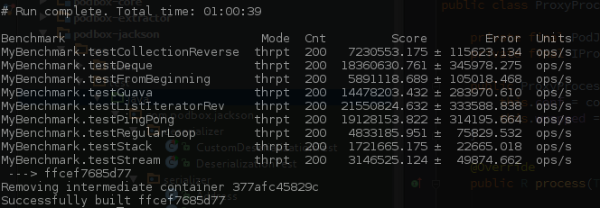

This benchmark covers a very precise case:
  
  We want to find last corresponding element of a sequence according to a criteria.
  In our use cases, this element is most likely placed near the end of the sequence.
  The sequences are not very large. (10 to 50)
  
  
We benchmark several methods according to a case similar to what's depicted above.
After executing this benchmark on three different n1-standard-1 instance of GCE (see https://cloud.google.com/compute/docs/machine-types?hl=en_US)
we obtain results of this fashion:

